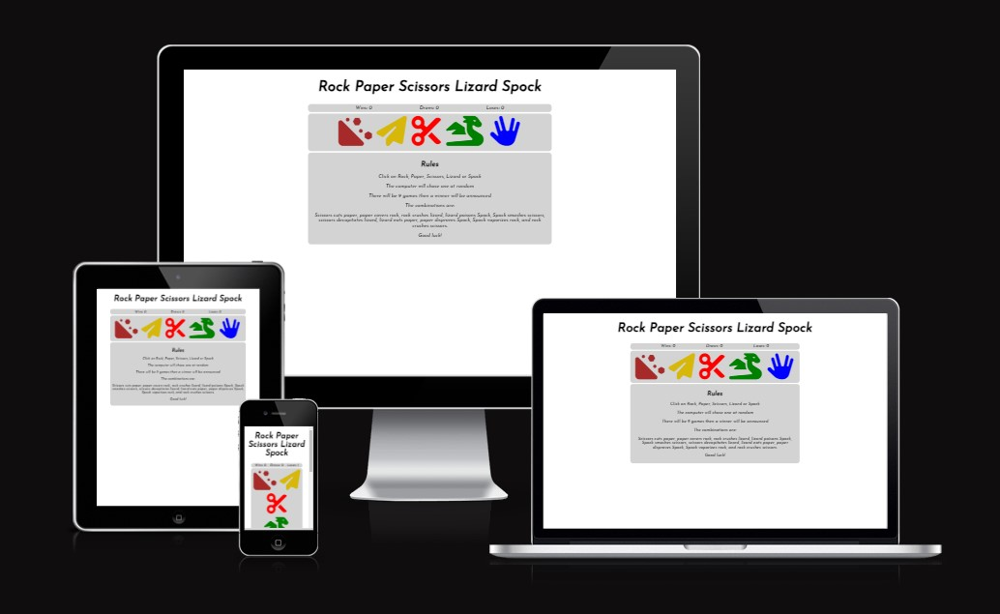
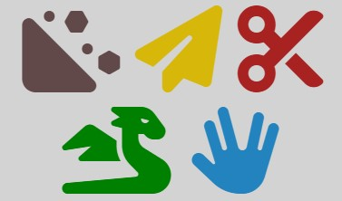
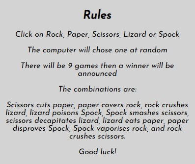
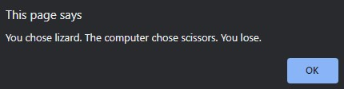
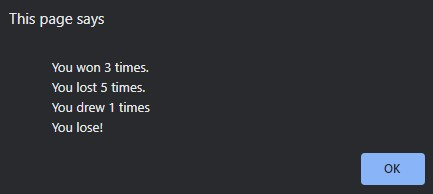
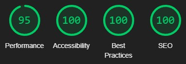

# Rock Paper Scissors Lizard Spock
This project was created to make a fun and interactive game of rock, paper, scissors, lizard, Spock. It is targeted towards anyone wanting to play the game against a computer. It is simple and easy to understand and interact with.
The project uses Javascript to be fully interactive, keep score and to be able to play against with random choices from the computer. The game deomnstrates how javascript can be used to create a game of chance.



## Planning and Development
- __Target Audience__
* The target audience is anyone who wants to play a game of rock, paper, scissors, lizard, Spock.
* It is also peole are interested in how javascript can be used to make an interactive site.

- __Site Objectives__
* To create an fun and interactive game.
* To show how Javascript can be used in the real world to make interactive web applications.

- __Approach__
* Use the principals of user design.
* To provide users with a game.
* To Provide users with an example of interactive web design.
* For the site to be accessible.

- __Colour Scheme__
The colours were chosen to distunguish between different aspects of the game.
* The background colour was used to seperate diffent areas of the game.
* The icon colours were chosen to help to distinguish between each icon.

- __Typography__
The fonts are taken from google fonts and were chosen to reflect the fun vibe the game wants to show.

## Features

### Current Features

-__Win/Lose/Draw counter__
* The win/lose/draw counter counts the score of the player and allows to show where they are in the game.
* It resets itself after every 9 games allowing players to know if they win or lose.


-__Interactive Icons__
* The icons are taken from Fontawsome.com (links to each icon are provided in the media section)
* Being a game the icons are kept in a cartoon style and as simple but fun icons to compliment the games aims.
* The rock icon is a small rock slide with the colour to represtent rocks.
* Paper is yellow in order to contrast with the other icons. It is also yellow as white did not contract well with the chosen grey background. It is a paper plane to keep with the fun style of the game.
* The scissors are red as a contrast to the other icons and keeps with the simple design of the other icons.
* The lizard is green to represtent the most common colour to make a lizard. It's icon is a dragon to keep with the fun atmosphere of the game.
* Spock is blue to match his uniform in Star-Trek. He is represented by the vulcan hand sybol that is often associated with him.



-__Rules Section__
* The rules section is there to explain how to play the game and the rules of the game.
* It allows any players to check if they are unsure of anything  about how the game works.


-__Alerts__
There are two types of alerts in the game:
* The first type tells players what they chose, Wwhat the computer chose and if they won, lost or drew.

* The second type shows users their points total at the end of a game and of they won lost or drew overall.


-__Favicon__
The favicon is chosen as it is a video game controller.

### Future Features and Improvements
In the future with this site I would like to add a few other features:
* Possibly animations or an animated popup for scores and both player and user choices.
* Other variations and score limits for the game such as classic Rock, Paper, Scissors and a best of 3/5/9 etc. mode.
* Other games to demonstrate Javascripts capabilities.

## Javascript
In this section i will show and explain the code used to make the site interactive.

### Computer choice
This function was built for the computer to randomly choose one of the options.
* Defines the options in an array outside the function.
* picks a random number from 0 to 4 by multiplying 5 by a number between 0 and 1 then rounding down. This is given the variable i.
* The compChoice veriable is set by finding where i sits in the options array e.g. if i = 3 then the compChoice is lizard.
* The function returns the choice.
```
let options = ["rock", "paper", "scissors", "lizard", "Spock"]
function computerChoice() {
    i = Math.floor(Math.random() * 5);
    let compChoice = options[i];
    return compChoice;
}
```

### Iterating totals
This function was built to add 1 to the total based on if the user won, lost, or drew.
* The function gets the current total from the html and assigns it an integer.
* The function then replaces the current total with the total +1.
```
function winCount() {
    let winsTotal = parseInt(document.getElementById("wins-total").innerText);
    document.getElementById("wins-total").innerHTML = ++winsTotal;
}
```
The loseCount() and drawCount() work the same for their respective totals.

### Game Reset
The game reset function is used to make sure the game is won. It is set to trigger when 9 games have been played.
* The function collects each total from wins, loses and draws and assigns them integers.
* It then adds the totals together.
* The function checks if the amount of points is 9 or greater, if it is then the rest of the function is ran, if not then the game continues as normal.
* If the number of games played is 9 or more, the function alerts the user of how many games they won, lost and have drawn. It compares the win total with the lose total and from this choses wether to tell the user if they won, lost or drew.
* After this it resets the win, lose, and draw totals back to 0 to start the game again.
```
function gameReset() {
    let winsTotal = parseInt(document.getElementById("wins-total").innerText);
    let loseTotal = parseInt(document.getElementById("lose-total").innerText);
    let drawTotal = parseInt(document.getElementById("draws-total").innerText);
    let gameCount = winsTotal + loseTotal + drawTotal;
    if (gameCount >= 9) {
        if (winsTotal == loseTotal) {
            var result = "draw"
        } else if (winsTotal > loseTotal) {
            var result = "win"
        } else if (winsTotal < loseTotal) {
            var result = "lose"
        }
        alert(`
        You won ${winsTotal} times.
        You lost ${loseTotal} times.
        You drew ${drawTotal} times
        You ${result}!
        `)
    document.getElementById("wins-total").innerHTML = 0
    document.getElementById("lose-total").innerHTML = 0
    document.getElementById("draws-total").innerHTML = 0
    }
}
```

### Win/Lose/Draw functions
Thes functions detemine if the user wins, loses or draws the game. There is one for each possible user choice each functioning the same with changes to the possible combinations and outcomes baised on the games rules.
* The function runs the computerChoice() function and sets a variable as what it returns.
* It then compares the computer choice with the user choice. In this expamle it it checks the computer choice agains the rules for the rock. The other functions work the same changing with the games rules.
* Once the correct rule is found an alert is sent to the user saying what they chose, what the computer chose and if they lost or won.
* The function then runs one of the three possibe iteration functions baised on if the user won, lost or drew.
```
function rockPick() {
    let compChoice = computerChoice();
    if (compChoice === "rock") {
        alert(`You chose rock. The computer chose rock. You draw!`);
        drawCount();
    } else if (compChoice === "scissors" || compChoice ===  "lizard"){
        alert(`You chose rock. The computer chose ${compChoice}. You Win!`);
        winCount();
    } else if (compChoice === "paper" || compChoice ===  "spock"){
        alert(`You chose rock. The computer chose ${compChoice}. You lose.`);
        loseCount();
    }
}
```

### User Pick Listener
This function is the core of the game. It tells the rest of the Javascript what the user chose and run the rest according to what the user chose.
* The funtion has an event listener waiting for the document to load before anything else is ran. This is expanded upon in the issues section.
* The function creates an array called buttons from the button tags in the html.
* The function iterates though the buttons.
* It then has an event listener listening for one of the buttons to be clicked. When a button is clicked it runs the function indide it.
* The function defines userChoice as the id of the button that is clicked and runs the coresponding function. 
* Finally once the correct fucntion has ran, the function runs the gameReset() function to check if the game needs reseting.
```
document.addEventListener("DOMContentLoaded", function (){
    let buttons = document.getElementsByTagName("button");

    for (let button of buttons) {
        button.addEventListener("click", function(){
            let userChoice = this.getAttribute("id")
            if (userChoice === "rock") {
                rockPick();
            } else if (userChoice === "paper") {
                paperPick();
            } else if (userChoice === "scissors") {
                scissorsPick();
            } else if (userChoice === "lizard") {
                lizardPick();
            } else if (userChoice === "spock") {
                spockPick();
            }
            gameReset();
        })
    }
})
```

## Testing
The site was tested on these devices:
* HP Omen with a 17" display - Chrome, Edge
* 27" monitor - Chrome, Edge (The website was ran on the HP Omen and this was to check sizing on larger displays)
* Samsung Galaxy S23 Ultra - Chrome, Samsung Internet
* iPad Air - Safari
* iPhone 13 - Safari
Google Dev-tools were used throughout to test responsiveness. This was also used to check the Javascript code was working though the console.
-__Testing the Game__
On all the devices I tested wether the game ran correctly. It was tested on different browsers and different sized screens to check the game functioned properly and the sizing of everything worked.

-__Validator Testing__
The HTML and CSS was ran though the W3C Code validator, both with no issues.
The Javascript was ran though a linter. It has some warnings which have been checked.
All the text colours passed a contrast checker for legibility.

-__Performace Testing__
The performance testing for the site was ran through Lighthouse on Google Dev-tools.


## Deployment
The site was deployed to GitHub pages. The steps to do this are:
* In the GitHub repository, go to settings.
* Navigate to pages.
* Switch the branch to "main".
* The page will refresh and show a successful deployment.
The live link is: https://jamie-s2000.github.io/rock-paper-scissors/

## Languages
The languages used are HTML, CSS and JavaScript.

## Software

Visual Studio Code was used to create and push the code to GitHub.

Git was used for version control.

## Media
All icons were taken from https://fontawsome.com

* Rock: https://fontawesome.com/icons/hill-rockslide?f=classic&s=solid
* Paper: https://fontawesome.com/icons/paper-plane?f=classic&s=solid
* Scissors: https://fontawesome.com/icons/scissors?f=classic&s=solid
* Lizard: https://fontawesome.com/icons/dragon?f=classic&s=solid
* Spock: https://fontawesome.com/icons/hand-spock?f=classic&s=solid

The font was taken from Google Fonts: https://fonts.google.com/specimen/Josefin+Sans

The favicon is from favicon.io : https://favicon.io/emoji-favicons/video-game